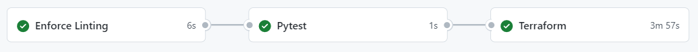

**This README.md is just a copy of the SOLUTION.md, which was required by the challenge statement.**

This is a description of the final solution. This document is divided in the following sections: `de module`, `deployment module`, time report and a suggestion of roadmap if we had the intention of further developing this project. At the end of the document you will also find my assessment of the whole experience.

# Table of Contents
- [Table of Contents](#table-of-contents)
- [de module](#de-module)
  - [Data Model](#data-model)
  - [Orchestrator](#orchestrator)
  - [Users, roles and permissions](#users-roles-and-permissions)
  - [Docker-compose](#docker-compose)
- [deployment module](#deployment-module)
  - [Overview](#overview)
  - [GitOps](#gitops)
- [Time Report](#time-report)
  - [Per activity](#per-activity)
  - [Per module](#per-module)
- [Roadmap](#roadmap)
- [A word from the candidate](#a-word-from-the-candidate)

# de module
In this module we built the ETL pipeline responsible for ingesting and processing the relevant data, such as the data that will be used in the machine learning model training.
## Data Model
The data model built is depicted below. Note that some types could be optimized, but I decided not to spend time doing it right now.
<figure>
<figcaption>Figure: Data Model built for the challenge. Image by dbdiagram.io.</figcaption></figure>
The data was originally stored as flat files in Amazon S3. To ingest it, transform and load into our postgres operational database, we used Airflow.

## Orchestrator
Airflow was picked as the orchestrator, since it seems to be an industry standard and it was also recommended by the problem statement. Three tasks were created:
- `load_client_data` is an one-off task that ingest flat files from S3 and store them locally.
- `load_sales_data` is run at the beginning of each month. It ingests and process the previous month sales data.
- `process_data` creates the feature store table.

In the below image we see that `load_sales_data` was run once for each available month, whereas the other two tasks were run just once.
<figure>
<figcaption>Figure: Airflow tasks after run.</figcaption></figure>

The dag `process_data` is shown below:
<figure>
<figcaption>Figure: Airflow DAG process_data.</figcaption></figure>
And after running the above pipelines, the tables are successfully found in the operational database, as seen in the database explorer client:
<figure>
<figcaption>Figure: Tables successfully created in operational database.</figcaption></figure>

I decided to use the most recent version of Airflow: 2.4.2. It was super nice, since in my current company we still use Airflow 1 and I was excited to try out the super useful [SmoothOperator](https://airflow.apache.org/docs/apache-airflow/stable/_api/airflow/operators/smooth/index.html) that comes packed with version 2.

## Users, roles and permissions
The users, roles and permissions of the operational database were defined in [modules/de/db_admin/setup_users.sql](modules/de/db_admin/setup_users.sql) file.

## Docker-compose
The system as a whole is managed by docker-compose. After running `docker-compose up -d`, we see that all services are ok.
<figure>
<figcaption>Figure: docker-compose services successfully running.</figcaption></figure>

And after executing Airflow tasks, the service `model-training` was able to create the model artifacts.
<figure>
<figcaption>Figure: model artifacts successfully created.</figcaption></figure>

I have encountered one problem regarding the operational-db permissions. Although it seems that the users, roles and permissions are successfully been created by [modules/de/db_admin/setup_users.sql](modules/de/db_admin/setup_users.sql), for some weird reason the `ds_user` was not being able to `SELECT` on the public schema tables. In benefit of the time, I decided not to spend more time than I already did looking for a definitive solution, and I have temporarily solved the problem by giving the model-training service admin credentials for the database. But that's not something I would do in an actual production environment, since it exposes security risks. So, how do I deal with this kind of difficulty in my work practice? The first step is to dedicate more time, by myself, in looking online for a solution. In the vast majority of cases it is enough to solve the problem. If I still couldn't solve it by myself, I would ask advice from some colleague that is more experienced in the tool in question. In the present case, since it is a postgres transactional database, I would look for someone that has already worked with DBA tasks before.

# deployment module
## Overview
The deployment was made on AWS EC2. Why did I decide to go serverful? I think serverless will become the industry standard, but in this challenge I decided to deploy on ec2. The reason is a little selfish: a couple of years ago I had the opportunity to deploy a ML model on aws lambda using the Serverless Framework (although I did not implement CICD or IaC in that case). So I thought I could use this opportunity to deploy in a "serverful" service like ec2, with the intention of getting a new experience. I would not use the same reasoning if it was not a mock challenge scenario!

The EC2 instance environment is set up with Docker. It pulls the mvww11/daredata image that I made publicly available in my Docker Hub repo and contains the necessary libs installed via pip, such as `mle_package` and `ds_package`.

High level overview of the implemented solution:
- A push is made to the main branch. It triggers the cicd pipeline with GitHub Actions. This cicd pipeline has 3 jobs:
  - Enforce linting with `black`. If the job fails, the pipe is interrupted and the deployment environment is not affected.
  - Testing with `pytest`. If any test fails, the pipe is interrupted and the deployment environment is not affected. I have used a very simple test with the single goal of illustrating how CI/CD pipelines rely on testing for quality assurance.
  - Deploy infrastructure using IaC with `terraform`.
    - Validade `terraform` code formating.
    - Validade `terraform` implementation plan.
    - If there is already an EC2 instance serving the model, destroy it.
    - `terraform` apply, spinning up a new EC2 instance and checking the new artifacts and API code within the instance.

One can see that the implemented DevOps strategy yields a period of downtime between the destruction of the old instance and the creation of the new one. I would like to understand the SLA better to figure out if it's worth it to spend more time building a blue/green DevOps strategy, where the old ec2 is only shut down after the new one is up and running, in order to avoid downtime.

A print of the actual Github Actions pipeline is shown below. (I just noticed I could've put the linting job and the testing job running in parallel, and the `terraform` job depending on both of them hehe. But it's not worth changing it now because the linting job takes only some seconds to complete):
<figure>
<figcaption>Figure: Github Actions CI/CD pipeline.</figcaption></figure>

Below we see the final result of the apply job, where the ec2 instance was created and its public ip was output in the logs, that can be seen directly in Github Actions page. The natural idea of getting a fixed ip or hostname for the instance was put on the roadmap at the end of this document.
<figure>
<figcaption>Figure: EC2 instance public ip output after apply has finished.</figcaption></figure>

If we take the public ip above and make an API request to it, we successfully receive the prediction made by the ML model.
<figure>
<figcaption>Figure: Model serving in real time.</figcaption></figure>

The cicd pipeline is also triggered by a PR to the main branch. In this case we also perform the linting and testing jobs of the pipeline, but the `terraform` job is modified by the following:
- We never destroy or create infrastructure when the cicd is triggered by a PR.
- We merely execute the formatting and plan validation steps, and we post the results in the PR page to assist the reviews in evaluating the merge.

Below we see a print of the `terraform` validation results that was automatically posted on the PR page by the cicd pipeline:
<figure>
<figcaption>Figure: Github Actions CI/CD pipeline.</figcaption></figure>

## GitOps
The IaC CI/CD explained above is an example of GitOps: changes made to the definition of the infrastructure in the git repo reflect on a given environment without manual intervention. But how did I implement GitOps for the API app code, besides the infrastructure? It is done because when the new EC2 is started, it is configured to automatically clone the new app code from the git repo. This configuration was made by means of `user data` for the AWS EC2. By the way, it is by means of `user data` that we:
- install docker and pull my mvww11/daredata docker image from Docker Hub.
- start the container that will serve our flask API application, setting up the port mapping between the instance and the container.
- get the ML model artifacts previously generated by `ds`.

The `user data` used is defined in the [infra/userdata.tpl](infra/userdata.tpl) file.

Note that if we want to make changes to the `ds` module or `mle` module and retrain the model, we would have to do it manually, generating a new mvww11/daredata image and running docker-compose locally. It was made this way by design, since the challenge SLA states that the only things that have to be on the cloud are the model artifacts and the api application. But I will put in the road the inclusion of this process in the GitOps workflow. It cloud function like this:
- whenever a change is made to the `ds`, `mle` or `de` modules, this process would be triggered.
- we would have to automatically `docker-compose up` and train the model again, generating new artifacts. Doing this would be a nice new challenge. This way we could even include the api app and the artifacts inside the mvww11/daredata image, so we would not need to get those elements via git clone within the EC2 instance.
- we would rebuild the mvww11/daredata image and tag it with a new version and with the tag `latest`.
- This new image with both tags would be pushed to Docker Hub
- The EC2 instance would be triggered to pull the new mvww11/daredata:latest from Docker Hub, and replace the container currently serving the flask api with a new container running the new image.
- This way the whole application would be adept to the GitOps paradigm.

# Time Report
## Per activity
Below I report the time I spent in each activity of the challenge. Please be aware that, although I made a real effort to track time spent, those intervals are estimated.
| module            | activity                                                                                                    | time (hours) |
| ----------------- | ----------------------------------------------------------------------------------------------------------- | -------- |
| `de module`         | Design thinking                                                                                             | 0.25     |
| `de module`         | Deploying airflow and operational-db services in docker-compose                                             | 1        |
| `de module`         | Implementing dags until model training became possible                                                      | 2        |
| `de module`         | Implementing model-training service in docker-compose until model artifacts were generated                  | 0.5      |
| `deployment module` | Studying ds and mle modules                                                                                 | 1        |
| `deployment module` | Design thinking                                                                                             | 0.25     |
| `deployment module` | Writing Dockerfile until run a container where ds and mle modules could be imported                         | 2        |
| `deployment module` | Creating and pushing above image to Docker Hub                                                              | 0.25     |
| `deployment module` | IaC: writing terraform files until possible to spin up EC2 instance via terraform cli and access it via ssh | 3        |
| `deployment module` | Writing \`user data\` until EC2 instance automatically install Docker and pulls above image                 | 1        |
| `deployment module` | Write flask application capable of generating predictions via local http request                            | 1        |
| `deployment module` | Serve above flask application via docker container                                                          | 0.25     |
| `deployment module` | Set up EC2 instance serving flask application through internet (predictions via internet!)                  | 1        |
| `deployment module` | set up CI/CD via github actions for IaC, flask app and linting enforcement                                  | 3        |
| Documentation     | Documentation                                                                                               | 5        |

## Per module
In the below table I sum up time spent per module, as well as totals.
| module            | time (hours) |
| ----------------- | ------------ |
| `de module`         | 3.75         |
| `deployment module` | 12.75        |
| Documentation     | 5            |
| Total             | 21.5         |

# Roadmap
Suggestion of roadmap if we had the intention of further developing this project.
- Install wsgi and nginx instead of using flask built-in webserver, which does not scale well to high request throughput.
- Implement Data Quality with `great expectations` for the input customer and sales data, as well as tables generated by the pipeline.
- Make operational-db persistent (persistance is currently implemented only for the airflow meta database).
- GitOps for `ds`, `mle` or `de` modules and model retraining. Include those, along with generated artifacts, within mvww11/daredata image.
- Fixed ip address or hostname for the API service.
- Security: I left all ports and protocols opened in the instance security group. Should open only the api serving port via TCP.
- Implement blue/green DevOps paradigm to minimize downtime when running CI/CD.
- Implement certificate to allow for HTTPS.
- Implement remote state to S3 and lock to DynamoDB so won't need to use Terraform Cloud.
- Remove hardcoded keys from code. e.g. operational-db users passwords. Aditionally, I already removed an ssh pub key the was hardcoded, but it still visible in repo's commit history, but it shouldn't be visible anywhere.

# A word from the candidate
What a great challenge it's been!

It was really fulfilling to put in practice skills that I have already studied in theory and followed along in online courses, but had never previously implemented myself. Namely deploying IaC in AWS with terraform using GitOps, deploying a flask application and managing permissions in a transactional database. In my experience, the first time I use a tool takes much more time to deploy it than the second time.

I feel confident that, if nothing less, completing this challenge really increased my toolbelt as a Data Engineer and my ability to troubleshoot deployment issues.

I believe that what makes me a valuable asset to a data squad is not the ability to implement some tool that I have already used before. It is my ability to, having a solid foundation on the entire data ecosystem, pick the best tool for the job in hand and deepen my knowledge on it enough so I can deploy a product in a timely manner. Not to mention my fierce effort to solve any tech challenge I may encounter!

I am available to explain any point of my solution by video or text. Just message me :)

Thank you for this opportunity and I hope to hear from you soon!

Marcus.